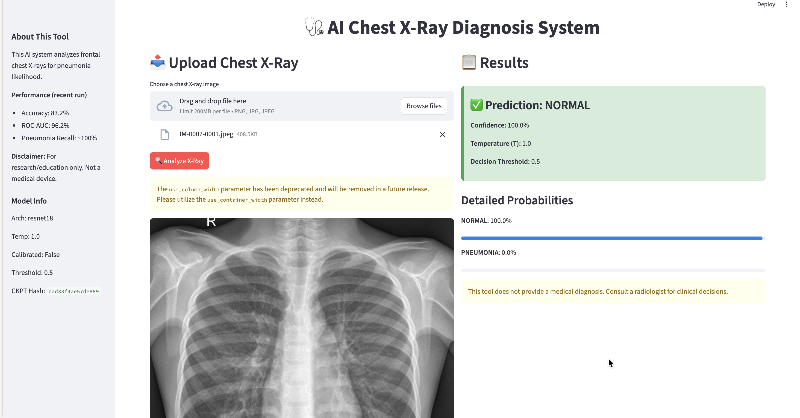

# AI Medical Diagnosis System

Automated disease detection from medical images using deep learning.

> NOTE: UI Screenshots (Normal vs Pneumonia) — add images to `docs/screenshots/ui_normal.png` and `docs/screenshots/ui_pneumonia.png`.
>
> | Normal Case | Pneumonia Case |
> |-------------|----------------|
> |  |  |

## Project Structure
- **data/**: Raw and processed datasets
- **src/**: Source code and core modules
- **notebooks/**: Exploratory and preprocessing analysis
- **scripts/**: Shell scripts for pipelines
- **tests/**: Unit testing modules
- **docs/**: Documentation & diagrams

## Quick Start
1. Clone repo  
2. Install dependencies (`pip install -r requirements.txt`)
3. Download dataset (`python src/data/collect_data.py`)  
4. Preprocess (`python src/data/preprocess.py`)  
5. Explore (`jupyter notebook notebooks/exploratory_data_analysis.ipynb`)  
6. Run tests (`pytest tests/`)

## Data Sources
- [Kaggle Chest X-Ray](https://www.kaggle.com/datasets)
- Local hospital dataset (anonymized)

## Core Features
- Modular data pipeline (metadata validation, augmentation, balanced sampling)
- Hydra-configurable experiments (model, data, training blocks)
- Multi-architecture support: ResNet18, DenseNet121, EfficientNet-B0
- Mixed precision (automatic disable on CPU/MPS without CUDA)
- Early stopping & checkpointing (best + last)
- Evaluation: confusion matrix, ROC, per-class metrics, misclassification grids
- Explainability: Grad-CAM batch generation + montage
- Experiment tracking (optional Weights & Biases)

## Recent Experiment (Hydra)
Checkpoint: `models/exp_hydra/best.pt`
Evaluation (validation/test aggregate):

| Metric | Value |
|--------|-------|
| Accuracy | 0.832 |
| Precision (weighted) | 0.789 |
| Recall (weighted) | 0.997 |
| F1 (weighted) | 0.881 |
| ROC AUC | 0.962 |
| Average Precision | (see extended eval) |
| Brier Score | (see extended eval) |

Detailed classification report:
```
NORMAL precision=0.99 recall=0.56 f1=0.71 support=234
PNEUMONIA precision=0.79 recall=1.00 f1=0.88 support=390
Overall accuracy=0.83
```
Confusion Matrix (rows=true, cols=pred):
```
          Pred NORMAL  Pred PNEUMONIA
TRUE NORMAL      130          104
TRUE PNEUMONIA      1          389
```
Key Insight: Model is highly sensitive to Pneumonia (recall ~1.00) but sacrifices specificity (NORMAL recall 0.56). Potential class imbalance or decision threshold bias.
